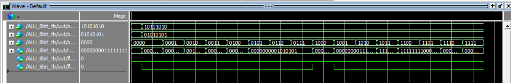

# 8-Bit Arithmetic Logic Unit (ALU)

## Project Overview

This project implements an 8-bit Arithmetic Logic Unit (ALU) in Verilog using ModelSim. The ALU performs a wide range of arithmetic and logical operations and is fully tested.  

An ALU is a core component in digital processors, responsible for performing mathematical computations and logical operations on binary data.

---

## Features

- **Supported Operations:**
  - Addition
  - Subtraction
  - Multiplication
  - Division
  - Logical Shift Left / Right
  - Rotate Left / Right
  - AND / NAND
  - OR / NOR
  - XOR / XNOR
  - Greater Than / Equal To Comparison
- **Flags:**
  - Zero Flag (Z)
  - Carry Out Flag (C)

---

## Waveform Output

---

## Contents

- `ALU_8bit.v` – Verilog RTL code for the ALU  
- `ALU_8bit_tb.v` – Testbench for verifying the ALU functionality  
- `ALUopwave.png` – Screenshot of simulation waveform output  
- `README.md` – This file
