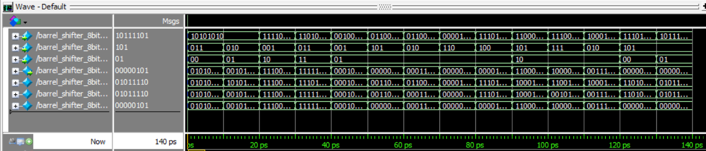

# 8-Bit Barrel Shifter

## Project Overview

This project implements an 8-bit barrel shifter in Verilog using ModelSim, supporting logical and arithmetic shifts. It is a mux-based design and uses parameterization for variable input length.

A barrel shifter is a digital circuit used in computer processors to efficiently perform bitwise shifting operations on binary data, either left or right by a specified number of positions.

---

## Features

- **Width:** 8-bit input (`data_in`)  
- **Shift Amount:** 0–7 (`smt`)  
- **Modes Supported:**  

| Mode | Code | Description |
|------|------|-------------|
| LSL  | 00   | Logical Shift Left |
| LSR  | 01   | Logical Shift Right |
| ASL  | 10   | Arithmetic Shift Left |
| ASR  | 11   | Arithmetic Shift Right |

- **Parameterizable** width for future extensions  
- **Mux-based stage-wise implementation** (shift by 1, 2, 4 bits)  
- Fully tested with **directed and randomized testbench**

---

## Output

**Console Output:**

Time=10 | data_in=10101010 | smt=3 | mode=00 (0) | data_out=01010000  
Time=20 | data_in=10101010 | smt=2 | mode=01 (1) | data_out=00101010  
Time=30 | data_in=11110000 | smt=1 | mode=10 (2) | data_out=11100000  
Time=40 | data_in=11010101 | smt=3 | mode=11 (3) | data_out=11111010  
Time=50 | data_in=00100100 | smt=1 | mode=01 (1) | data_out=00010010  
Time=60 | data_in=01100011 | smt=5 | mode=01 (1) | data_out=00000011  
Time=70 | data_in=01100101 | smt=2 | mode=01 (1) | data_out=00011001  
Time=80 | data_in=00001101 | smt=6 | mode=01 (1) | data_out=00000000  
Time=90 | data_in=11101101 | smt=4 | mode=01 (1) | data_out=00001110  
Time=100 | data_in=11000110 | smt=5 | mode=10 (2) | data_out=11000000  
Time=110 | data_in=11100101 | smt=7 | mode=10 (2) | data_out=10000000  
Time=120 | data_in=10001111 | smt=2 | mode=10 (2) | data_out=00111100  
Time=130 | data_in=11101000 | smt=5 | mode=00 (0) | data_out=00000000  
Time=140 | data_in=10111101 | smt=5 | mode=01 (1) | data_out=00000101  

**Waveform Output:**

---

## Contents

- `barrel_shifter_8bit.v` – Verilog RTL code for the Barrel Shifter  
- `barrel_shifter_8bit_tb.v` – Testbench for verifying the Barrel Shifter's functionality  
- `BSopwave.png` – Screenshot of simulation waveform output  
- `README.md` – This file
