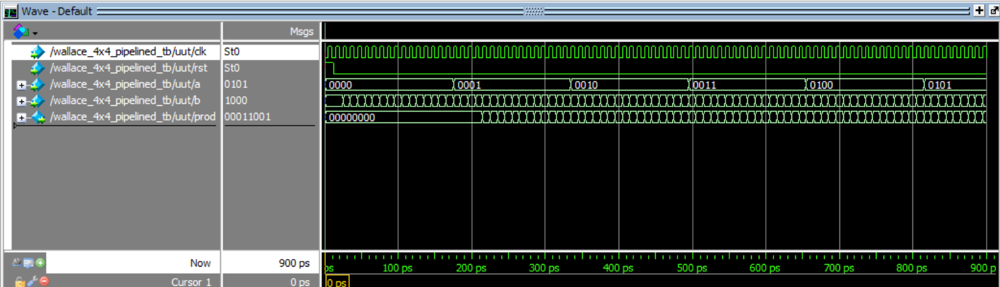

# 4×4 Pipelined Wallace Tree Multiplier

## Project Overview

This project implements a 4-bit by 4-bit Wallace Tree Multiplier using Verilog HDL. The design features a Full Adder and Half Adder based Wallace reduction stage, followed by a Carry Lookahead Adder (CLA) for the final addition. The multiplier is pipelined for improved performance at the cost of latency. The project was simulated and verified using ModelSim.

The Wallace Tree architecture is well known for its high speed multiplication, especially suitable for digital signal processing (DSP) and arithmetic heavy applications.

---

## Features

- **Inputs:**  
  - `a [3:0]`: 4-bit multiplicand  
  - `b [3:0]`: 4-bit multiplier  

- **Output:**  
  - `prod [7:0]`: 8-bit product

- **Full Adder and Half Adder based product reduction**
- **Final stage 8-bit CLA**  
- **Three stage pipelined architecture**   
- **Fully tested and simulated in ModelSim**

---

## Output

**Console Output:**

` Cycle |  a   b |  prod  | expected | PASS/FAIL`   
    `    3  |  0   1 |    0   |     0    | PASS` 
    `    4  |  0   2 |    0   |     0    | PASS` 
    `    5  |  0   3 |    0   |     0    | PASS` 
    `    6  |  0   4 |    0   |     0    | PASS` 
    `    7  |  0   5 |    0   |     0    | PASS` 
    `    8  |  0   6 |    0   |     0    | PASS` 
    `    9  |  0   7 |    0   |     0    | PASS` 
   `   10  |  0   8 |    0   |     0    | PASS` 
   `   11  |  0   9 |    0   |     0    | PASS` 
   `   12  |  0  10 |    0   |     0    | PASS` 
   `   13  |  0  11 |    0   |     0    | PASS` 
   `   14  |  0  12 |    0   |     0    | PASS` 
   `   15  |  0  13 |    0   |     0    | PASS` 
   `   16  |  0  14 |    0   |     0    | PASS` 
   `   17  |  0  15 |    0   |     0    | PASS` 
   `   18  |  1   0 |    0   |     0    | PASS` 
   `   19  |  1   1 |    0   |     0    | PASS` 
   `   20  |  1   2 |    0   |     0    | PASS` 
   `   21  |  1   3 |    1   |     1    | PASS` 
   `   22  |  1   4 |    2   |     2    | PASS` 
   `   23  |  1   5 |    3   |     3    | PASS` 
   `   24  |  1   6 |    4   |     4    | PASS` 
   `   25  |  1   7 |    5   |     5    | PASS` 
   `   26  |  1   8 |    6   |     6    | PASS` 
   `   27  |  1   9 |    7   |     7    | PASS` 
   `   28  |  1  10 |    8   |     8    | PASS` 
   `   29  |  1  11 |    9   |     9    | PASS` 
   `   30  |  1  12 |   10   |    10    | PASS` 
   `   31  |  1  13 |   11   |    11    | PASS` 
   `   32  |  1  14 |   12   |    12    | PASS` 
   `   33  |  1  15 |   13   |    13    | PASS` 
   `   34  |  2   0 |   14   |    14    | PASS` 
   `   35  |  2   1 |   15   |    15    | PASS` 
   `   36  |  2   2 |    0   |     0    | PASS` 
   `   37  |  2   3 |    2   |     2    | PASS` 
   `   38  |  2   4 |    4   |     4    | PASS` 
   `   39  |  2   5 |    6   |     6    | PASS` 
   `   40  |  2   6 |    8   |     8    | PASS` 
   `   41  |  2   7 |   10   |    10    | PASS` 
   `   42  |  2   8 |   12   |    12    | PASS` 
   `   43  |  2   9 |   14   |    14    | PASS` 
   `   44  |  2  10 |   16   |    16    | PASS` 
   `   45  |  2  11 |   18   |    18    | PASS` 
   `   46  |  2  12 |   20   |    20    | PASS` 
   `   47  |  2  13 |   22   |    22    | PASS` 
   `   48  |  2  14 |   24   |    24    | PASS` 
   `   49  |  2  15 |   26   |    26    | PASS` 
   `   50  |  3   0 |   28   |    28    | PASS` 
   
**Waveform Output:**

---

## Contents

- `wallace_4x4_pipelined.v` – Verilog RTL code for the Wallace Tree Multiplier
- `wallace_4x4_pipelined_tb.v` – Verilog Testbench for the Wallace Tree Multiplier
- `half_adder.v` – Verilog RTL code for the Half Adder
- `full_adder.v` – Verilog RTL code for the Full Adder
- `cla_4bit.v` – Verilog RTL code for the 4-bit Carry Lookahead Adder
- `cla_8bit.v` – Verilog RTL code for the 8-bit Carry Lookahead Adder
- `WPopwave.png` – Screenshot of simulation waveform output  
- `README.md` – This file

