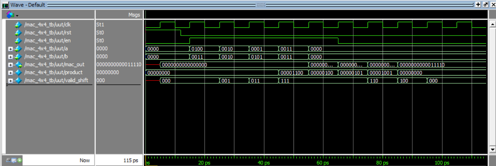

# 4×4 MAC using Pipelined Wallace Tree Multiplier

## Project Overview

This project implements a 4-bit by 4-bit Multiply-Accumulate (MAC) unit in Verilog HDL. The design uses a 3-stage pipelined Wallace Tree Multiplier for fast multiplication, followed by a 16-bit accumulator that sums the results of sequential multiplications. The multiplier employs Full Adder and Half Adder based Wallace reduction, and uses a Carry Lookahead Adder (CLA) for the final addition stage.

The pipelined MAC is particularly suitable for DSP and signal processing applications where multiple products need to be accumulated efficiently. The design is tested and verified using ModelSim.

---

## Features

- **Inputs:**  
  - `a [3:0]` – 4-bit multiplicand  
  - `b [3:0]` – 4-bit multiplier  
  - `clk` – System clock  
  - `rst` – Synchronous reset  
  - `en` – Enable signal to trigger a multiply-accumulate operation

- **Output:**  
  - `mac_out [15:0]` – 16-bit accumulated result

- **Uses a three stage pipelined Wallace Tree Multiplier**
- **MAC result is aligned using a 3-cycle delayed enable signal**
- **Fully tested and simulated in ModelSim**

---

## Output

**Console Output:**

`Expected MAC result: 30`  
`Actual MAC result: 30`  
`MAC test PASSED` 

**Waveform Output:**

---

## Contents

- `mac_4x4.v` – Verilog RTL code for the 4x4 MAC unit  
- `mac_4x4_tb.v` – Verilog testbench for the MAC unit  
- `MACopwave.png` – Simulation waveform showing MAC behavior  
- `README.md` – This file
- `Multiplier` – Folder containing the files for the Wallace Tree Multiplier
