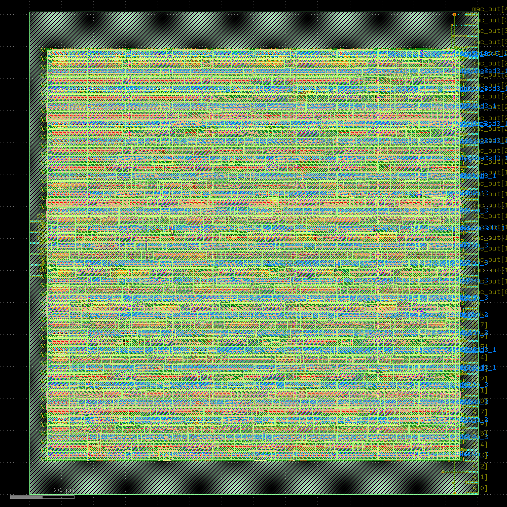

# RTL to GDSII Implementation of an 8x8 MAC Unit using Librelane

## Project Overview

This project demonstrates the full ASIC physical design flow from RTL to GDSII of an 8-bit by 8-bit Multiply-Accumulate (MAC) Unit using the Librelane open-source PDK and toolchain. The MAC unit is built using a Pipelined 8x8 Dadda Multiplier for fast multiplication.

The Verilog RTL design is simulated using ModelSim, then synthesized and physically implemented using tools such as Yosys, OpenROAD, Magic, and Netgen. The final layout is exported in GDSII format and successfully passes DRC and LVS verification.

This pipelined MAC architecture is well-suited for DSP applications requiring repeated high-speed multiply-accumulate operations.

The complete flow is available in a Google Colab Notebook for free and can be run in any browser in Librelane's Github Repository ([Librelane](https://github.com/librelane/librelane)).

---

## Features

- **Inputs:**  
  - `A [7:0]` – 8-bit multiplicand  
  - `B [7:0]` – 8-bit multiplier  
  - `clk` – System clock  
  - `rst` – Synchronous reset  
  - `en` – Enable signal to trigger a multiply-accumulate operation

- **Output:**  
  - `mac_out [31:0]` – 32-bit accumulated result

- **Design Highlights:**
  - Pipelined 8x8 Dadda Multiplier for fast multiplication  
  - Pipelined architecture for improved throughput  
  - Fully implemented using the Librelane open-source digital flow
  - RUN_POST_GPL_DESIGN_REPAIR and RUN_POST_CTS_RESIZER_TIMING were used separately to pass STA

---

## Physical Design Flow (RTL to GDSII)

The following steps were successfully completed using the Librelane toolchain:

1. **RTL Design & Simulation** – Functional verification of the MAC unit using ModelSim  
2. **Synthesis** – RTL to gate-level netlist conversion using Yosys  
3. **Floorplanning** – Definition of core area and placement constraints  
4. **Tap & Endcap Cell Insertion** – Ensures latch-up prevention and well tie-off  
5. **I/O Placement** – Proper placement of input/output pads  
6. **Power Distribution Network (PDN)** – Generation of VDD/VSS power grid  
7. **Global Placement** – Rough placement of standard cells  
8. **Repairing Slew and Fanout Violations** – Buffer and cell sizing optimization using `RUN_POST_GPL_DESIGN_REPAIR`  
9. **Detailed Placement** – Legalized cell placement within site rows  
10. **Clock Tree Synthesis (CTS)** – Balancing and buffering of the clock network  
11. **Repairing Hold Violations** – Timing optimization using `RUN_POST_CTS_RESIZER_TIMING`  
12. **Global Routing** – Planning of routing tracks across the die  
13. **Detailed Routing** – Exact metal routing of nets  
14. **Fill Insertion** – Density equalization to meet manufacturing rules  
15. **Parasitics Extraction (RCX)** – Resistance/Capacitance extraction for delay estimation  
16. **Static Timing Analysis (Post-PnR)** – Setup/hold checks using extracted parasitics  
17. **Stream-out** – Export of final design to GDSII format  
18. **Design Rule Checks (DRC)** – Ensures the layout complies with manufacturing rules  
19. **SPICE Extraction** – Netlist extraction from layout for LVS  
20. **Layout vs. Schematic (LVS)** – Validates that the layout matches the schematic/netlist 

---

## Output

**Final GDSII Layout Visualization:**

---

## Contents

- `Flow.ipynb` – Jupyter (Colab) notebook automating the complete RTL to GDSII flow using the Librelane toolchain  
- `GDS.png` – Visual representation of the final GDSII layout (`mac_8x8.gds`)  
- `mac.v` – Verilog file containing:
  - 8x8 MAC unit  
  - 8x8 Dadda multiplier  
  - 16-bit CLA  
  - Full and Half Adders  
- `mac_8x8.gds` – Final GDSII layout file of the implemented MAC design  

---
