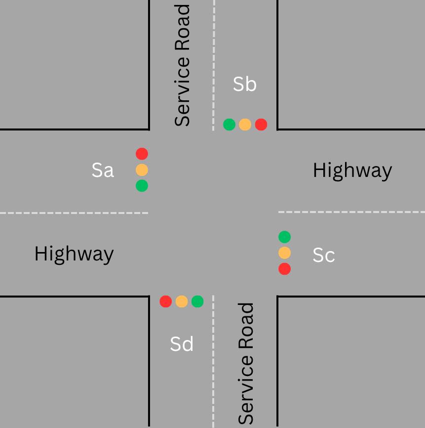

# 4-Way Traffic Light Controller (TLC)

## Project Overview

This project implements a Traffic Light Controller for a 4-way intersection using Verilog HDL. The design ensures coordinated light control for two highway lanes (A and C) and two service roads (B and D). The controller uses a Moore finite state machine (FSM) and sensor based decision making to efficiently manage vehicle flow.

The highway gets higher priority through longer green light duration (`GTH`) and green light on highway being the defualt state, while the service road is served only when vehicles are detected (`Sb`, `Sd`) and highway conditions allow. Only one road is allowed to have green lights at a time i.e. either the highway or the service road can be green at a given time.
This project was tested and simulated using ModelSim.

---

## Features

- **Inputs:**
  - `clk`: System clock  
  - `rst`: Active-high reset  
  - `Sa, Sb, Sc, Sd`: Vehicle presence sensors for each direction (A–D)

- **Outputs:**
  - `Ra, Ya, Ga`: Red, Yellow, Green for Light A (Highway)  
  - `Rb, Yb, Gb`: Red, Yellow, Green for Light B (Service)  
  - `Rc, Yc, Gc`: Red, Yellow, Green for Light C (Highway)  
  - `Rd, Yd, Gd`: Red, Yellow, Green for Light D (Service)

- **Timing Parameters (configurable):**
  - `GTH = 8`: Green time for highway (A, C)  
  - `GTS = 5`: Green time for service road (B, D)  
  - `YT = 2`: Yellow light duration

- **Finite State Machine (FSM):**
  - `s0`: Highway Green, Service Red  
  - `s1`: Highway Yellow, Service Red  
  - `s2`: Service Green, Highway Red  
  - `s3`: Service Yellow, Highway Red

---

## Diagrams

The images below of the intersection and the FSM state diagram provide a clearer understanding of the project.

---

## Output

**Console Output:**

`Time:    5 | A:     GREEN   B:     RED     C:     GREEN   D:     RED    | Sensors Sa:0 Sb:0 Sc:0 Sd:0`  
`Time:   15 | A:     GREEN   B:     RED     C:     GREEN   D:     RED    | Sensors Sa:0 Sb:0 Sc:0 Sd:0`  
`Time:   25 | A:     GREEN   B:     RED     C:     GREEN   D:     RED    | Sensors Sa:0 Sb:1 Sc:0 Sd:1`  
`Time:   35 | A:     GREEN   B:     RED     C:     GREEN   D:     RED    | Sensors Sa:0 Sb:1 Sc:0 Sd:1`  
`Time:   45 | A:     GREEN   B:     RED     C:     GREEN   D:     RED    | Sensors Sa:0 Sb:1 Sc:0 Sd:1`  
`Time:   55 | A:     GREEN   B:     RED     C:     GREEN   D:     RED    | Sensors Sa:0 Sb:1 Sc:0 Sd:1`  
`Time:   65 | A:     GREEN   B:     RED     C:     GREEN   D:     RED    | Sensors Sa:0 Sb:1 Sc:0 Sd:1`  
`Time:   75 | A:     GREEN   B:     RED     C:     GREEN   D:     RED    | Sensors Sa:0 Sb:1 Sc:0 Sd:1`  
`Time:   85 | A:     GREEN   B:     RED     C:     GREEN   D:     RED    | Sensors Sa:0 Sb:1 Sc:0 Sd:1`  
`Time:   95 | A:     YELLOW  B:     RED     C:     YELLOW  D:     RED    | Sensors Sa:0 Sb:1 Sc:0 Sd:1`  
`Time:  105 | A:     YELLOW  B:     RED     C:     YELLOW  D:     RED    | Sensors Sa:0 Sb:1 Sc:0 Sd:1`  
`Time:  115 | A:     RED     B:     GREEN   C:     RED     D:     GREEN  | Sensors Sa:0 Sb:1 Sc:0 Sd:1`  
`Time:  125 | A:     RED     B:     GREEN   C:     RED     D:     GREEN  | Sensors Sa:1 Sb:1 Sc:1 Sd:1`  
`Time:  135 | A:     RED     B:     GREEN   C:     RED     D:     GREEN  | Sensors Sa:1 Sb:1 Sc:1 Sd:1`  
`Time:  145 | A:     RED     B:     GREEN   C:     RED     D:     GREEN  | Sensors Sa:1 Sb:1 Sc:1 Sd:1`  
`Time:  155 | A:     RED     B:     GREEN   C:     RED     D:     GREEN  | Sensors Sa:1 Sb:1 Sc:1 Sd:1`  
`Time:  165 | A:     RED     B:     GREEN   C:     RED     D:     GREEN  | Sensors Sa:1 Sb:1 Sc:1 Sd:1`  
`Time:  175 | A:     RED     B:     GREEN   C:     RED     D:     GREEN  | Sensors Sa:1 Sb:1 Sc:1 Sd:1`  
`Time:  185 | A:     RED     B:     GREEN   C:     RED     D:     GREEN  | Sensors Sa:1 Sb:1 Sc:1 Sd:1`  
`Time:  195 | A:     RED     B:     GREEN   C:     RED     D:     GREEN  | Sensors Sa:1 Sb:1 Sc:1 Sd:1`  
`Time:  205 | A:     RED     B:     GREEN   C:     RED     D:     GREEN  | Sensors Sa:1 Sb:1 Sc:1 Sd:1`  
`Time:  215 | A:     RED     B:     GREEN   C:     RED     D:     GREEN  | Sensors Sa:1 Sb:1 Sc:1 Sd:1`  
`Time:  225 | A:     RED     B:     GREEN   C:     RED     D:     GREEN  | Sensors Sa:1 Sb:0 Sc:1 Sd:0`  
`Time:  235 | A:     RED     B:     YELLOW  C:     RED     D:     YELLOW | Sensors Sa:1 Sb:0 Sc:1 Sd:0`  
`Time:  245 | A:     RED     B:     YELLOW  C:     RED     D:     YELLOW | Sensors Sa:1 Sb:0 Sc:1 Sd:0`  
`Time:  255 | A:     GREEN   B:     RED     C:     GREEN   D:     RED    | Sensors Sa:1 Sb:0 Sc:1 Sd:0`  
`Time:  265 | A:     GREEN   B:     RED     C:     GREEN   D:     RED    | Sensors Sa:1 Sb:0 Sc:1 Sd:0`  
`Time:  275 | A:     GREEN   B:     RED     C:     GREEN   D:     RED    | Sensors Sa:1 Sb:0 Sc:1 Sd:0`  
`Time:  285 | A:     GREEN   B:     RED     C:     GREEN   D:     RED    | Sensors Sa:1 Sb:0 Sc:1 Sd:0`  
`Time:  295 | A:     GREEN   B:     RED     C:     GREEN   D:     RED    | Sensors Sa:1 Sb:0 Sc:1 Sd:0`  
`Time:  305 | A:     GREEN   B:     RED     C:     GREEN   D:     RED    | Sensors Sa:1 Sb:0 Sc:1 Sd:0`  
`Time:  315 | A:     GREEN   B:     RED     C:     GREEN   D:     RED    | Sensors Sa:1 Sb:0 Sc:1 Sd:0`  

**Waveform Output:**

---

## Contents

- `TLC.v` – Verilog RTL code for the TLC  
- `TLC_tb.v` – Verilog Testbench for the TLC
- `Intersection.png` - Picture of the intersection
- `State_Diagram.png` - Picture of the FSM State Diagram  
- `TLCopwave.png` – Screenshot of the waveform simulation output  
- `README.md` – This file
