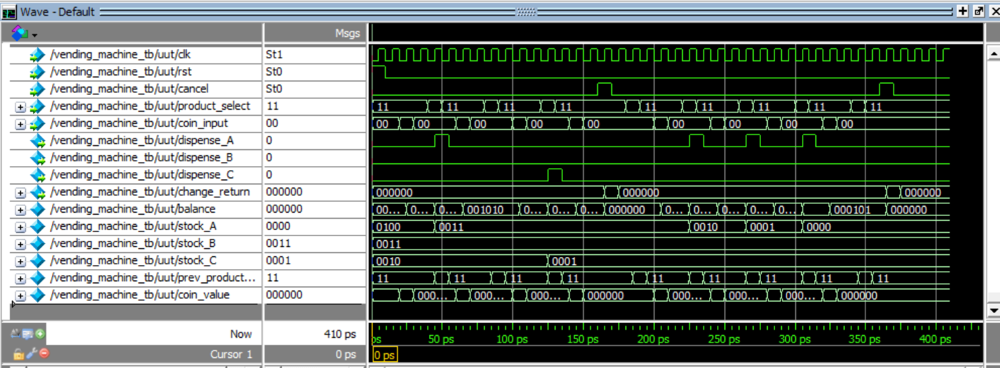

# Vending Machine

## Project Overview

This project implements a coin-based Vending Machine using Verilog HDL. The machine accepts coins, allows product selection, returns change, and manages inventory. The design models a Mealy Finite State Machine (FSM), where outputs depend on both current inputs and internal state.

The vending machine supports three products (`A`, `B`, and `C`) with distinct prices and tracks inventory levels. The system responds to coin insertion, product selection, and cancellation requests synchronously with a clock, making it suitable for FPGA or ASIC implementation. The design was thoroughly tested and simulated using ModelSim.

---

## Features

- **Inputs:**
  - `clk`: System clock  
  - `rst`: Active-high synchronous reset  
  - `cancel`: Cancel request — returns remaining balance  
  - `coin_input [1:0]`: Represents coin inserted  
    - `00`: No coin  
    - `01`: ₹5  
    - `10`: ₹10  
  - `product_select [1:0]`: Product selection  
    - `00`: Product A  
    - `01`: Product B  
    - `10`: Product C

- **Outputs:**
  - `dispense_A`: Dispense signal for Product A  
  - `dispense_B`: Dispense signal for Product B  
  - `dispense_C`: Dispense signal for Product C  
  - `change_return [5:0]`: Amount of change returned (in rupees)

- **Product Pricing:**
  - Product A: ₹5  
  - Product B: ₹10  
  - Product C: ₹20

- **Machine Characteristics:**
  - Handles coin insertion, product purchase, cancel requests, and change return  
  - Tracks inventory levels for each product (initial stock: A=4, B=3, C=2)  
  - Returns change immediately upon cancel  
  - Prevents dispensing if insufficient balance or stock

---

## Output

**Console Output:**  

`Starting Vending Machine Testbench`  
`Time: 0 | Balance Returned:  0 | Dispense A: 0, B: 0, C: 0`  
`Time: 45 | Balance Returned:  0 | Dispense A: 1, B: 0, C: 0`  
`Time: 55 | Balance Returned:  0 | Dispense A: 0, B: 0, C: 0`  
`Time: 125 | Balance Returned:  0 | Dispense A: 0, B: 0, C: 1`  
`Time: 135 | Balance Returned:  0 | Dispense A: 0, B: 0, C: 0`  
`Time: 165 | Balance Returned: 10 | Dispense A: 0, B: 0, C: 0`  
`Time: 175 | Balance Returned:  0 | Dispense A: 0, B: 0, C: 0`  
 
`Inventory Depletion Test: Product A`  
`Time: 225 | Balance Returned:  0 | Dispense A: 1, B: 0, C: 0`  
`Time: 235 | Balance Returned:  0 | Dispense A: 0, B: 0, C: 0`  
`Time: 265 | Balance Returned:  0 | Dispense A: 1, B: 0, C: 0`  
`Time: 275 | Balance Returned:  0 | Dispense A: 0, B: 0, C: 0`  
`Time: 305 | Balance Returned:  0 | Dispense A: 1, B: 0, C: 0`  
`Time: 315 | Balance Returned:  0 | Dispense A: 0, B: 0, C: 0`  
`Time: 365 | Balance Returned:  5 | Dispense A: 0, B: 0, C: 0`  
`Time: 375 | Balance Returned:  0 | Dispense A: 0, B: 0, C: 0`  
`Inventory depletion test complete.`  
`Test complete.`

**Waveform Output:**  

---

## Contents

- `vending_machine.v` – Verilog RTL code of the vending machine  
- `vending_machine_tb.v` – Verilog testbench simulating coin insertion, purchases, cancellations, and inventory depletion  
- `VMopwave.png` – Screenshot of waveform output from ModelSim  
- `README.md` – This file
